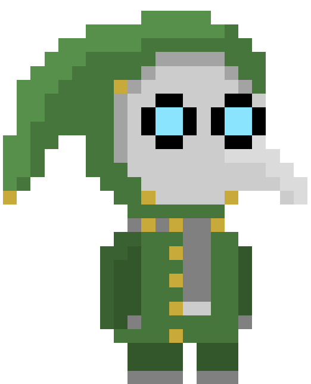

<h1>Brainrot Vaccine Extension</h1>

 

Extension created to prevent yourself to access vicious websites that is injuring our attention and our brain.

<h2>Browsers Compatibility</h2>

<table>
    <tr>
        <td>
             Chrome
        </td>
        <td>
             Firefox
        </td>
        <td>
             Opera
        </td>
        <td>
             Brave
        </td>
        <td>
             Edge
        </td>
        <td>
             Vivaldi
        </td>
        <td>
             Safari
        </td>
        <td>
             Zen
        </td>
    </tr>
    <tr>
        <td>
            
        </td>
        <td>
            
        </td>
        <td>
            
        </td>
        <td>
            
        </td>
                <td>
            
        </td>
        <td>
            
        </td>
        <td>
            
        </td>
        <td>
            
        </td>
    </tr>
</table>

<h2>Extension working: </h2>

<h2>Section for developers: </h2>

<h2>💻 What I need to have installed in my pc ?</h2>

<ul>
    <li>Browser (prefered chrome based)</li>
    <li>NVM (Node Version Manager)</li>
    <li>Nodejs && NPM</li>
</ul>

<h2>▶️ How to run the project ?</h2>
<ul>
<li>Step 0: Clone the repository and access the folder in your `terminal`</li><br/ >

<li>Step 1: After this run `nvm use` to load node version that this project is running and `npm install` to install all dependencies in your local project</li>
<br/ >

<li>Step 2: After this, you need to generate a build, running this command: `npm run build`</li>
<br/ >

<li>Step 3: enter in `chrome://extensions` in your browser, turn on the developer settings,</li>
<br/ >

<li>Step 4: Click in Load Unpackage and browse to `/dist` folder in your project, and you are ready to run.</li>
</ul>
